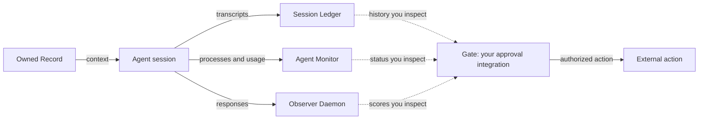

# Agent oversight

You can lose session history, miss running agents, and overlook repeated response failures.
Use this stack to inspect agent work and keep its records on your machine.

| Tool | What you use it for |
|---|---|
| [session-ledger](https://github.com/b2bvic/session-ledger) | Archive and search local Claude Code transcripts in SQLite. |
| [agent-monitor](https://github.com/b2bvic/agent-monitor) | Inspect matching processes and recorded token usage in Markdown. |
| [observer-daemon](https://github.com/b2bvic/observer-daemon) | Score responses against writing rules and record violations. |
| [owned-record](https://github.com/b2bvic/owned-record) | Keep domain context, activity logs, and reusable procedures in Markdown. |

Solid arrows show data or action flow. Dotted arrows show evidence you supply to your gate.
The tools run independently. They do not ship a shared approval gate or automatic connections between all components.
You must enforce approval where an action executes. A passing response score does not authorize a send, payment, or deletion.

Start with each tool's README for installation, sample output, and configuration.
