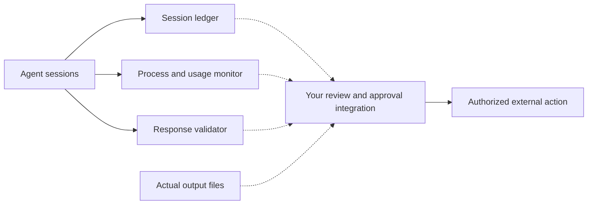

# Agent orchestration patterns: agent-oversight

Agent-oversight documents independent checks for operators who coordinate Claude Code and Codex CLI sessions on hosted models.
Use these patterns when session history, process status, response quality, and action approval need separate evidence.

[Project page](https://scalewithsearch.com/code/agent-oversight)

## Install

Use Git and Python 3.11 or newer for the synthetic fixture checks.
Install each linked component separately when you need its runtime features.

```bash
git clone https://github.com/b2bvic/agent-oversight.git
cd agent-oversight
```

## Quick start

Run the fixture contract checks without reading personal transcripts:

```bash
python3 -m unittest discover -s tests -v
```

Inspect the [synthetic transcript examples](examples/README.md).
They exercise provider identity collisions, mirrored assistant text, tool correlation, and recorded token fields.
These checks validate the fixtures. Component repositories test the parsers that consume them.

## How it works

This documentation hub describes patterns a team can adopt from a single-operator multi-agent system.
Claude Code orchestration and a Codex CLI workflow require your own coordinator and approval integration.
For multi-agent orchestration oversight, collect evidence before accepting a completion claim.


```mermaid
flowchart LR
    Session[Agent sessions] --> Ledger[Session ledger]
    Session --> Monitor[Process and usage monitor]
    Session --> Observer[Response validator]
    Ledger -.-> Review[Your review and approval integration]
    Monitor -.-> Review
    Observer -.-> Review
    Artifacts[Actual output files] -.-> Review
    Review --> Action[Authorized external action]
```

Solid arrows show data flow. Dotted arrows show evidence that you supply to your integration.
Keep human judgment at the decision and action boundary.
Use [Evaluate the stack](EVALUATION.md) to record inputs, revisions, checks, failures, and missing evidence.

## Limits

- The tools run independently. This repository supplies no integrated orchestrator, shared scheduler, or universal approval service.
- A process observation does not prove task completion. A writing score does not verify facts or authorize an action.
- Session records preserve statements and tool outputs. Verify important outcomes against actual artifacts or the destination.
- The examples are synthetic. This repository contains no measured team deployment or comparative model benchmark.
- Enforce approval where an external action executes. Adding these tools alone does not create that boundary.

## Related repositories

| Repository | Role in the orchestration cluster |
|---|---|
| [agent-monitor](https://github.com/b2bvic/agent-monitor) | Observe local Claude and Codex processes and recorded usage. |
| [session-ledger](https://github.com/b2bvic/session-ledger) | Archive local transcripts in SQLite and export JSON records. |
| [observer-daemon](https://github.com/b2bvic/observer-daemon) | Score responses against configured writing rules. |
| [observer-protocol](https://github.com/b2bvic/observer-protocol) | Capture Markdown intake and track local draft status. |
| [route-domain](https://github.com/b2bvic/route-domain) | Load example context files from matching Claude Code prompts. |
| [skills](https://github.com/b2bvic/skills) | Search sessions, select context, and check declared local artifacts. |
| [safe-api](https://github.com/b2bvic/safe-api) | Apply configured dry-run, scope, and breaker controls to REST writes. |

See [owned-record](https://github.com/b2bvic/owned-record) for the owned memory cluster.

## License

[MIT](LICENSE).
